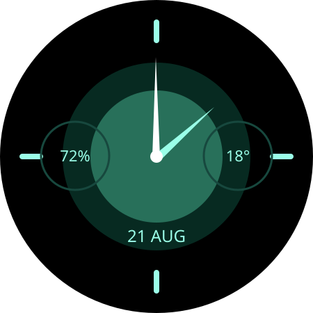
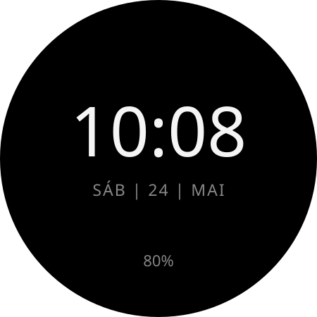
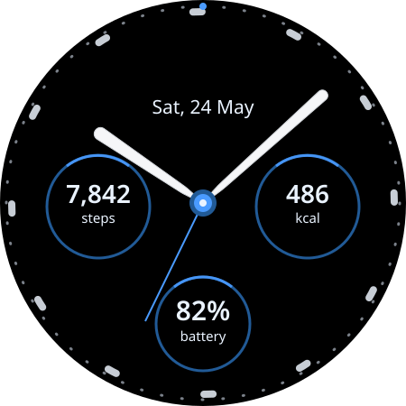

# WearFaces

Coleção open source de mostradores independentes para Wear OS, escritos em
[Watch Face Format](https://developer.android.com/training/wearables/wff). Cada
mostrador é um módulo Android resource-only e gera seu próprio APK/AAB.

## Compatibilidade

O baseline de execução é **Wear OS 5 / Android 14 / API 34 / WFF 2**, com o
Xiaomi Watch 2 como primeiro alvo físico. Os módulos usam `minSdk 34`,
`compileSdk 35` e `targetSdk 35`, preservando Wear OS 5 e atendendo ao requisito
de publicação Wear OS vigente a partir de 31 de agosto de 2026.

## Mostradores

| Mostrador | Estado | Recursos |
| --- | --- | --- |
| [Aurora](faces/aurora/) | MVP 0.1.0 | Analógico, data, 2 complications, 4 paletas e AOD |
| [Essential](faces/essential/) | MVP 0.1.0 | Digital/Analógico, data, bateria, 4 campos radiais editáveis sem aro, cores, marcadores e AOD |
| [Flow](faces/flow/) | MVP 0.1.0 | Analógico, data, 3 complications editáveis, 4 paletas, AMOLED preto e AOD |

### Previews

| Aurora | Essential | Flow |
| :---: | :---: | :---: |
| [](faces/aurora/) | [](faces/essential/) | [](faces/flow/) |

Os previews representam o modo ativo e as configurações padrão. Valores de
complications são ilustrativos; no Essential, os quatro campos opcionais não
aparecem porque começam vazios. Screenshots reais serão adicionadas depois da
validação no dispositivo e continuam sendo a evidência visual definitiva.

## Início rápido

Android Studio é opcional. O ambiente oficial fornece build, validação, ADB e
emulação Wear OS em containers; qualquer editor ou IDE pode ser usado. No host,
instale somente Git, Bash e Podman. Emulação acelerada também requer KVM e, para
a janela nativa, Wayland ou X11/XWayland.

```bash
./scripts/wearfaces doctor
./scripts/wearfaces build-all
./scripts/wearfaces emulator
# Em outro terminal:
./scripts/wearfaces preview essential
```

Comandos principais:

```bash
./scripts/wearfaces validate [face]
./scripts/wearfaces build <face>
./scripts/wearfaces bundle <face>
./scripts/wearfaces install <face>
./scripts/wearfaces emulator --headless
./scripts/wearfaces adb devices
```

Consulte [desenvolvimento](docs/DEVELOPMENT.md),
[container](docs/CONTAINER.md), [testes](docs/TESTING.md) e o fallback de
[ADB por Wi-Fi em relógio físico](docs/ADB_WIFI.md).

## Criar um mostrador

O gerador valida o slug, cria módulo e especificação, configura identidade e
registra o Gradle automaticamente:

```bash
./scripts/wearfaces create minimal01 --name "Minimal 01"
./scripts/wearfaces validate minimal01
./scripts/wearfaces build minimal01
```

Complete primeiro `docs/watchfaces/MINIMAL01.md`; depois edite
`faces/minimal01/src/main/res/raw/watchface.xml`. O template contém apenas um
mostrador digital neutro, preview vetorial e estrutura WFF 2 mínima.

## Releases e contribuição

Releases seguem SemVer coordenado e publicam APK e AAB por módulo com checksums;
veja [RELEASE.md](docs/RELEASE.md). Contribuições são bem-vindas conforme
[CONTRIBUTING.md](CONTRIBUTING.md).

## Novo mostrador a partir de foto ou mockup

Toda referência visual passa primeiro pelo processo
[da referência à especificação](docs/REFERENCE_TO_SPEC.md) e pelo
[template obrigatório](docs/watchfaces/TEMPLATE.md). O Codex deve persistir uma
especificação autocontida — incluindo proveniência, observações, coordenadas,
WFF 2, paletas, complications, AOD, assets, prompt normalizado e aceite — antes
de implementar o novo módulo.

O código é GPL-3.0-only. Assets precisam ter autoria e licença próprias
documentadas; nenhum material proprietário da Xiaomi, Google ou terceiros é
aceito sem autorização compatível.
